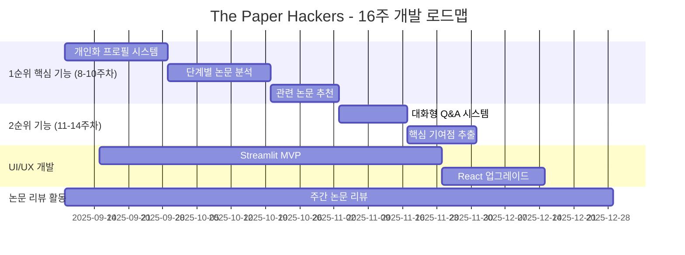

# The Paper Hackers

<h1 align="center"> The Paper Hackers </h1>

<div align="center">
<a href="https://pseudo-lab.com"></a>
<a href="https://discord.gg/EPurkHVtp2"></a>
<a href="https://github.com/Pseudo-Lab/10th-template/stargazers"></a>
<a href="https://github.com/Pseudo-Lab/10th-template/network/members"></a>
<a href="https://github.com/Pseudo-Lab/10th-template/pulls"></a>
<a href="https://github.com/Pseudo-Lab/10th-template/issues"></a>
<a href="https://github.com/Pseudo-Lab/10th-template/graphs/contributors"></a>
</div>
<br>

<!-- sheilds: https://shields.io/ -->
<!-- hits badge: https://hits.seeyoufarm.com/ -->

> Welcome to The Paper Hackers repository! We aim to create a personalized paper reading assistant that understands researchers' background knowledge and research directions, offering tools for context-aware paper analysis, step-by-step understanding, and research idea generation. Join us in revolutionizing how researchers read and understand academic papers through AI-powered innovation!


🚀 **The Paper Hackers** — 연구자의 배경지식과 연구 방향을 이해하는 개인화된 논문 리딩 어시스턴트
“논문 읽기의 새로운 패러다임을 제시하며, 연구자 중심의 AI 어시스턴트 개발”
기존 도구들의 한계를 극복한 맥락 인식형 논문 분석 Agent를 통해 연구 혁신을 실현합니다.

## 🌟 프로젝트 목표 (Project Vision)
*"개인화된 논문 분석으로 연구자의 생산성을 극대화하는 AI 어시스턴트"* 
- 개인화 논문 분석: 연구자의 배경지식과 맥락을 고려한 맞춤형 논문 요약 및 분석
- 단계별 이해 지원: Abstract → Method → Results → Discussion (Conclusion) 순서의 체계적 논문 분석
- 연구 아이디어 도출: 읽은 논문들을 기반으로 한 새로운 개발 방향 제안
- 실용적 MVP 개발: 16주 내 실제 사용 가능한 웹 기반 논문 리딩 어시스턴트 완성
- 논문 리뷰 문화: 매주 논문 1편 리뷰를 통한 도메인 지식 축적 및 도구 검증

## 🔎 기존 도구들의 한계점과 우리의 해결책
**현재 논문 리뷰 도구들의 문제점**
- ChatPDF: 단순 Q&A, 논문 구조 이해 부족
- Elicit: 검색 중심, 깊이 있는 분석 한계
- ResearchRabbit: 시각화 특화, 내용 이해 제한적

## 🚩 우리의 혁신적 접근
✅ 개인화 프로필 기반 분석: 연구자의 배경지식과 관심사 반영  
✅ 단계별 Q&A 제공: 논문 구조에 따른 맞춤형 질의응답 시스템  
✅ 지식 축적 시스템: 읽은 논문들 간의 연관성 파악 및 논문 추천, 연구 아이디어 도출  


## 🧑 역동적인 팀 소개 (Dynamic Team)

| 역할          | 이름 |  기술 스택 배지                                                                 | 주요 관심 분야                          |
|---------------|------|-----------------------------------------------------------------------|----------------------------------------|
| **Project Manager** | [박수형](https://github.com/Coding-Child) |     | Information Extraction & Retriever|
| Member | [황윤희](https://www.linkedin.com/in/meuni/) |    | LLM / RAG / MultiAgent |


## 🚀 프로젝트 로드맵 (Project Roadmap)

## 🛠️ 핵심 기능 및 기술 스택 (Core Features & Tech Stack)
**핵심 기능 우선순위**
🎯 1순위 (8-10주차 완성 목표)
1. 개인화 프로필 기반 논문 요약: 사용자의 연구 분야, 선행지식 수준 고려
2. 단계별 논문 분석: Abstract → Method → Results → Discussion 순서로 맞춤형 Q&A 제공
3. 관련 논문 추천: 읽은 논문 기반 개인화 추천

🎯 2순위 (11-14주차 목표)
1. 대화형 깊이 있는 Q&A: 논문 특정 부분 상세 질의응답
2. 핵심 기여점 추출: "이 논문이 내 관심분야에 어떤 도움이 될까?" 자동 분석

## 🛠️ 우리의 개발 문화 (Our Development Culture)
**우리의 개발 문화**  
```python
class TechStack:
    def __init__(self):
        self.backend = {
            'framework': 'FastAPI',
            'ai_engine': 'LangChain + OpenAI/Claude/Huggingface',
            'database': 'ChromaDB',
            'paper_api': 'arXiv API + OpenAlex'
        }
        self.frontend = {
            'mvp': 'Streamlit',
            'production': 'React + Tailwind CSS'
        }
        self.deployment = {
            'platform': 'Vercel/Streamlit Cloud',
            'ci_cd': 'GitHub Actions'
        }
```


## 📈 성과 지표 (Achievement Metrics)
**2024 주요 KPI**  
| 지표                     | 목표치 | 현재 달성률 |
|--------------------------|--------|-------------|
| 커밋 수                  | 800  | 0%         |
| MVP 핵심 기능 완성        | 5개  | 0%         |
|실제 논문 분석 테스트       | 20편 | 0%         |
|사용자 피드백 수집         | 10명  | 0%         |
|논문 리뷰 완료             | 32편  | 0%         |
|논문 리뷰 블로그 게시물     | 32편  | 0%         |


## 💻 주차별 활동 (Activity History)

| 주차 | 날짜 | 개발 주제/파트 | 담당자 | 논문 리뷰 | 산출물 |
|------|------|---------------|--------|-----------|--------|
| 1주차 | 2025/09/08 | **OT & 킥오프**<br>- 팀 소개 & 역할 분담<br>- 기술 스택/레포 세팅<br>- 프로젝트 로드맵 확정 | 박수형 | 각자 관심 분야 선택 | Repo 초기화, 운영 가이드, 팀별 역할표 |
| 2주차 | 2025/09/15 | API 연동 실험 (arXiv, OpenAlex) | TBD | 논문 2편 리뷰 및 발표 | 논문 데이터 fetch 코드 |
| 3주차 | 2025/09/22 | 요약 모델 적용, 기본 UI 목업 제작 | TBD | 논문 2편 리뷰 및 발표 | 요약 데모 코드, UI 시안 |
| 4주차 | 2025/09/29 | 대화형 QA 모듈 PoC | TBD | 논문 2편 리뷰 및 발표 | QA 프로토타입 코드 |
| 5주차 | 2025/10/06 | 개인화 추천 초기 버전 구현 | TBD | 논문 2편 리뷰 및 발표 | 추천 시스템 코드 |
| 6주차 | 2025/10/13 | 개인화 프로필 시스템 개발 | TBD | 논문 2편 리뷰 및 발표 | 프로필 관리 모듈 |
| 7주차 | 2025/10/20 | 단계별 논문 분석 기능 구현 | TBD | 논문 2편 리뷰 및 발표 | 단계별 분석 엔진 |
| 8주차 | 2025/10/27 | UI/UX 개선 및 사용성 테스트 | TBD | 논문 2편 리뷰 및 발표 | 개선된 UI, 테스트 결과 |
| 9주차 | 2025/11/03 | 관련 논문 추천 시스템 완성 | TBD | 논문 2편 리뷰 및 발표 | 추천 알고리즘 |
| 10주차 | 2025/11/10 | 1차 MVP 통합 및 테스트 | 전체 | 논문 2편 리뷰 및 발표 | MVP v1.0, 테스트 리포트 |
| 11주차 | 2025/11/17 | 대화형 Q&A 시스템 개발 | TBD | 논문 2편 리뷰 및 발표 | Q&A 모듈 |
| 12주차 | 2025/11/24 | 핵심 기여점 추출 기능 개발 | TBD | 논문 2편 리뷰 및 발표 | 기여점 분석 모듈 |
| 13주차 | 2025/12/01 | 성능 최적화 및 버그 수정 | 전체 | 논문 2편 리뷰 및 발표 | 최적화된 코드, 버그 수정 리포트 |
| 14주차 | 2025/12/08 | 사용자 피드백 반영 및 개선 | 전체 | 논문 2편 리뷰 및 발표 | 개선된 MVP, 피드백 분석 |
| 15주차 | 2025/12/15 | 최종 MVP 완성 및 문서화 | 전체 | 논문 2편 리뷰 및 발표 | 완성된 MVP, 기술 문서 |
| 16주차 | 2025/12/22 | **최종 데모 발표** | 전체 | 프로젝트 전체 리뷰 | MVP 공개, 발표자료, 리뷰 모음집 |


## 💡 학습 자원 (Learning Resources)
**우리가 구축할 지식 허브**  
- Weekly Paper Reviews: 팀원들의 논문 리뷰 아카이브
- Technical Blog Posts: 개발 과정 및 기술적 인사이트 공유


## 🌱 참여 안내 (How to Engage)
- 러너로 참여 — 연구·개발·테스트 등 실행
- 청강 참여 — 공개 세션 참여 가능

❗️참여 링크: [가짜연구소 디스코드](https://discord.gg/EPurkHVtp2)  
❗️커뮤니케이션 채널: 디스코드 [#Room-DH](https://discord.com/channels/944032730050621450/1068785242690830366)

**누구나 청강을 통해 모임을 참여하실 수 있습니다.**  
1. 특별한 신청 없이 정기 모임 시간에 맞추어 디스코드 [#Room-DH](https://discord.com/channels/944032730050621450/1068785242690830366) 채널로 입장
2. Magical Week 중 행사에 참가
3. Pseudo Lab 행사에서 만나기

## Acknowledgement 🙏

이 프로젝트는 가짜연구소 Open Academy로 진행됩니다.
연구자들의 논문 읽기 경험을 혁신하고자 하는 모든 분들의 참여와 기여에 깊은 감사를 전합니다.

Special thanks to our contributors and the research community for their valuable insights in developing personalized paper reading assistants. Together, we're making academic research more accessible and efficient.

## About Pseudo Lab 👋🏼</h2>

[Pseudo-Lab](https://pseudo-lab.com/) is a non-profit organization focused on advancing machine learning and AI technologies. Our core values of Sharing, Motivation, and Collaborative Joy drive us to create impactful open-source projects. With over 5k+ researchers, we are committed to advancing machine learning and AI technologies.

<h2>Contributors 😃</h2>
<a href="https://github.com/Pseudo-Lab/The-Paper-Hackers/graphs/contributors">
  
</a>
<br><br>

<h2>License 🗞</h2>

This project is licensed under the [MIT License](https://opensource.org/licenses/MIT).
